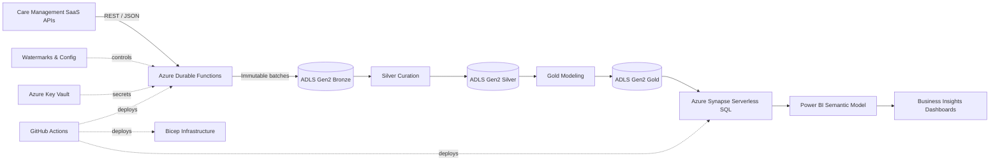

<div align="center">

# 🏥 Homecare Business Insights Platform
### Azure Data Engineering & Analytics Case Study

[](https://azure.microsoft.com/)
[](https://www.python.org/)
[](#)
[](#)
[](https://powerbi.microsoft.com/)
[](#)
[](#)

**Operational APIs → Azure Functions → ADLS Gen2 → Bronze / Silver / Gold → Synapse SQL → Power BI**

</div>

---

## Overview

This repository is a **sanitized technical case study** of a homecare-services analytics platform I worked on professionally. The original implementation integrated operational data from a care-management SaaS platform into Microsoft Azure and prepared it for reporting and business intelligence.

The production repository, client data, credentials, API identifiers, infrastructure names, and proprietary implementation details are intentionally **not published** here. This public version focuses on the architecture, data-engineering decisions, reliability patterns, and analytics design.

The platform was designed to transform operational API data into a governed analytical model for reporting areas such as client activity, service delivery, care hours, visit history, staff availability, service performance, and operational KPIs.

---

## Architecture



### Data flow

```text
Operational APIs
      │
      ▼
Durable Function Orchestration
      │
      ├── Incremental / full / date-range extraction
      ├── Retry + rate-limit handling
      └── Watermark management
      │
      ▼
BRONZE — immutable raw Parquet
      │
      ▼
SILVER — typed, normalized, deduplicated entities
      │
      ▼
GOLD — analytics-ready dimensions, facts and marts
      │
      ▼
Synapse Serverless SQL Views
      │
      ▼
Power BI Reports & KPIs
```

---

## What I worked on

This project involved both **data engineering and analytics engineering** responsibilities:

- Building Python ingestion workflows for REST APIs
- Supporting incremental, full-refresh, date-range, and entity-loop ingestion strategies
- Maintaining watermarks so recurring loads request only required changes
- Preserving immutable raw data in a Bronze layer for replay and auditability
- Curating typed and deduplicated Silver datasets
- Building Gold analytical models and SQL marts
- Handling nested API structures and child arrays
- Designing history logic for time-varying client and visit data
- Exposing Parquet-backed datasets through Synapse Serverless SQL
- Building Power BI datasets and operational/business insight views
- Defining Azure infrastructure with Bicep
- Automating deployment workflows with GitHub Actions
- Keeping credentials outside source control and using managed-secret patterns

---

## Lakehouse-style data layers

| Layer | Purpose | Key characteristics |
|---|---|---|
| **Bronze** | Preserve source data | Immutable batches, partitioned storage, replayable raw history |
| **Silver** | Clean and conform | Typed fields, normalization, deduplication, nested-data handling |
| **Gold** | Serve analytics | Facts, dimensions, historical models, KPI-ready datasets |
| **SQL serving** | Query layer | Synapse views over Parquet for BI consumption |
| **Power BI** | Decision layer | KPIs, trends, service/client insights and management reporting |

---

## Incremental ingestion strategy

A major engineering requirement was avoiding unnecessary full reloads while still protecting against late-arriving updates.

The pipeline uses a **watermark pattern**:

```text
Read last successful watermark
        │
        ▼
Subtract a small overlap window
        │
        ▼
Request source records changed since that time
        │
        ▼
Write immutable Bronze batch
        │
        ▼
Deduplicate downstream using business keys
        │
        ▼
Advance watermark only after successful processing
```

The overlap window reduces the risk of missing records updated close to the boundary between two pipeline runs.

A simplified public example is available in [`src/watermark_example.py`](src/watermark_example.py).

---

## Data modeling

The analytical layer follows warehouse-style patterns:

- **Dimensions** for relatively stable descriptive entities
- **Facts** for visits, activities, service events, and transactional records
- **Cross-reference tables** for many-to-many structures returned by nested APIs
- **Historical tables** for entities where changes over time must be preserved
- **Marts** for reporting-specific calculations such as service hours and operational performance

A simplified example is shown in [`sql/service_hours_example.sql`](sql/service_hours_example.sql).

---

## Reliability patterns

### Idempotency
A rerun should not create duplicate analytical records. Business keys and deduplication logic are applied during curation.

### Raw-data immutability
Bronze data is never overwritten, making debugging, audit, replay, and schema investigation easier.

### Retry and throttling
API calls require bounded retries, timeout handling, and respect for source rate limits.

### Watermark safety
Watermarks advance only after successful processing, with overlap windows protecting against boundary misses.

### Schema evolution
External APIs can add or change fields. Raw ingestion is separated from typed curation so downstream models can evolve safely.

### Observability
Application logging and cloud monitoring are part of the architecture so failed endpoints or abnormal loads can be investigated.

---

## Infrastructure & CI/CD

```text
Bicep
 ├── Storage / Data Lake
 ├── Function App
 ├── Key Vault
 ├── Monitoring
 └── Synapse resources

GitHub Actions
 ├── Infrastructure deployment
 ├── Function deployment
 ├── SQL/view deployment
 └── Controlled first-load / backfill workflows
```

This separates infrastructure, application code, and data-model deployment concerns while keeping environment changes reproducible.

---

## Analytics layer

The platform supported operational and management reporting around:

- Service hours and delivery trends
- Client and service activity
- Visit status and historical changes
- Operational workload patterns
- Staff/service availability
- KPI monitoring
- Revenue and service-performance relationships where relevant to the reporting model

No client-identifying dashboard data is included in this public repository.

---

## Tech stack

| Area | Technologies |
|---|---|
| **Language** | Python, SQL |
| **Orchestration** | Azure Durable Functions |
| **Storage** | Azure Data Lake Storage Gen2, Parquet |
| **Transformation** | Python, layered Bronze/Silver/Gold design |
| **Query / Serving** | Azure Synapse Serverless SQL |
| **Analytics** | Power BI, DAX, Power Query |
| **Infrastructure as Code** | Bicep |
| **CI/CD** | GitHub Actions |
| **Secrets / Monitoring** | Azure Key Vault, Application Insights |

---

## Repository structure

```text
Homecare-Business-Insights-Platform/
├── .github/workflows/
│   └── validate.yml
├── docs/
│   ├── architecture.md
│   └── security-and-privacy.md
├── samples/
│   └── synthetic_pipeline_config.json
├── src/
│   └── watermark_example.py
├── sql/
│   └── service_hours_example.sql
├── .gitignore
├── LICENSE
└── README.md
```

---

## Confidentiality note

This is **not a mirror of the production/client repository**. The public case study deliberately excludes real client or employee records, client/company names, source-system account identifiers, API credentials, Azure subscription/resource identifiers, production endpoints, exact production schemas, private Power BI datasets, and proprietary application source code.

The examples in this repository are synthetic and are included only to explain the engineering patterns used.

---

## Skills demonstrated

`Azure Data Engineering` · `ETL/ELT` · `Incremental Loading` · `Data Lake Architecture` · `Bronze/Silver/Gold` · `Parquet` · `Synapse SQL` · `Python` · `Power BI` · `Bicep` · `GitHub Actions` · `Analytics Engineering` · `Data Governance`

---

<div align="center">

**Hooria Khan**  
Perception Engineer · Data Engineer · Data Analyst

[GitHub Profile](https://github.com/hooriaakhann)

</div>
