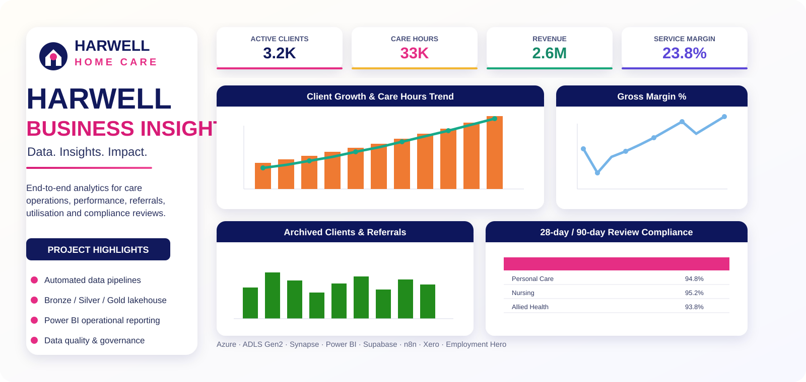
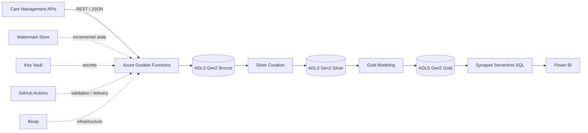

<div align="center">

# 🏥 Homecare Business Insights Platform
### Azure Data Engineering & Analytics — Public Portfolio Edition



[](https://azure.microsoft.com/)
[](https://www.python.org/)
[](#)
[](#)
[](https://powerbi.microsoft.com/)
[](#)
[](#)

**Care-management APIs → Azure Durable Functions → ADLS Gen2 → Bronze / Silver / Gold → Synapse Serverless SQL → Power BI**

</div>

---

## Overview

This repository is a **public-safe technical reimplementation of a professional homecare analytics platform** I worked on. It preserves the engineering architecture and representative implementation patterns while excluding client-owned source code, real client/employee records, production resource identifiers, credentials, internal endpoints, and private dashboards.

The original project integrated operational care-management data into Azure and transformed it into analytics-ready models for reporting areas such as visits, service delivery, client activity, care hours, staff/service performance, history tracking, and operational KPIs.

This portfolio edition is intentionally substantial: it includes working examples of the pipeline layers rather than only an architecture diagram.

---

## Architecture



```text
Source APIs
   │
   ▼
Bronze ingestion
   │ immutable batch Parquet
   ▼
Silver curation
   │ normalized + deduplicated entities
   ▼
Gold builders
   │ dimensions + facts + history + marts
   ▼
Synapse Serverless SQL
   │
   ▼
Power BI
```

---

## Pipeline layers

### 🥉 Bronze — immutable ingestion

[`src/bronze/ingest.py`](src/bronze/ingest.py)

The Bronze layer demonstrates:

- REST API pagination
- incremental loading using persisted watermarks
- overlap windows for late-arriving updates
- batch IDs and date-based paths
- Parquet serialization
- immutable raw storage
- extraction of nested child arrays into separate datasets

Example layout:

```text
bronze/
└── source/
    ├── clients/date=YYYY-MM-DD/batch=<id>/clients.parquet
    └── visits/date=YYYY-MM-DD/batch=<id>/visits.parquet
```

### 🥈 Silver — typed and deduplicated

[`src/silver/curate.py`](src/silver/curate.py)

The Silver layer merges new Bronze batches with existing curated data and applies:

- field normalization
- business-key deduplication
- latest-record selection
- endpoint-specific ordering fields
- stable Parquet outputs for downstream modeling

```text
silver/
├── clients/clients.parquet
├── employees/employees.parquet
├── services/services.parquet
└── visits/visits.parquet
```

### 🥇 Gold — analytics-ready tables

[`src/gold/build.py`](src/gold/build.py)

Representative Gold contracts include:

```text
dim_client
dim_client_history
dim_employee
dim_service
fact_visit
fact_visit_component
fact_visit_component_version
fact_care_summary
fact_client_action
fact_client_note
fact_service_request
xref_client_funding_history
xref_visit_schedule_component
xref_careplan_section
```

Visit facts are partitioned by year/month to demonstrate a scalable analytical layout.

---

## History handling

Professional reporting often needs more than the latest state.

[`src/history/client_history.py`](src/history/client_history.py) demonstrates an **SCD Type 2** pattern for client attributes, while [`src/history/visit_history.py`](src/history/visit_history.py) separates visit-version history from the current visit state.

This allows questions such as:

- What was a client's service/funding state at a past date?
- How did a visit change after scheduling?
- What is the latest version of each schedule/component?
- Which attributes changed over time?

---

## Incremental loading & watermarks

[`src/shared/watermark.py`](src/shared/watermark.py)

```text
Read last successful watermark
          │
          ▼
Subtract overlap window
          │
          ▼
Request changed records
          │
          ▼
Write Bronze batch
          │
          ▼
Curate Silver / build Gold
          │
          ▼
Advance watermark only after success
```

The overlap window is deliberate: it reduces the risk of missing changes that occur close to the boundary between two scheduled runs.

---

## API reliability

[`src/shared/api_client.py`](src/shared/api_client.py) demonstrates:

- bearer-token authentication from environment variables
- company/context headers
- page-based iteration
- request timeouts
- bounded retry logic
- exponential backoff
- HTTP 429 / `Retry-After` handling

No real token, company ID, vendor hostname, or production endpoint is stored in the repository.

---

## Synapse serving layer

[`sql/create_bi_views.sql`](sql/create_bi_views.sql) demonstrates Synapse Serverless SQL views over Gold Parquet.

A BI-facing visit view uses `ROW_NUMBER()` to expose one latest schedule-level row while still retaining the component-grain Gold data separately.

[`sql/marts/care_hours.sql`](sql/marts/care_hours.sql) builds a simplified reporting mart for:

- scheduled hours
- delivered hours
- delivery variance
- service/client/employee linkage

---

## Azure infrastructure as code

The [`infra/`](infra/) folder contains parameterized Bicep modules for:

- ADLS Gen2 storage
- Azure Function App
- Azure Key Vault
- Application Insights / Log Analytics
- Azure Synapse workspace

Resource names are generated from a generic project prefix and `uniqueString()` rather than exposing production resource names.

Secrets are secure parameters and are not committed.

---

## CI validation

[`.github/workflows/validate.yml`](.github/workflows/validate.yml) runs:

- Python syntax compilation
- JSON validation
- unit tests

This keeps the public implementation reproducible without embedding any production deployment credentials.

---

## Repository structure

```text
Homecare-Business-Insights-Platform/
├── .github/
│   └── workflows/
│       └── validate.yml
├── config/
│   ├── care_endpoint_schemas.example.json
│   └── config.example.json
├── docs/
│   ├── architecture.md
│   └── security-and-privacy.md
├── infra/
│   ├── main.bicep
│   └── modules/
│       ├── appinsights.bicep
│       ├── functionapp.bicep
│       ├── keyvault.bicep
│       ├── storage.bicep
│       └── synapse.bicep
├── samples/
│   └── synthetic_pipeline_config.json
├── sql/
│   ├── create_database.sql
│   ├── create_bi_views.sql
│   └── marts/
│       └── care_hours.sql
├── src/
│   ├── bronze/
│   │   └── ingest.py
│   ├── silver/
│   │   └── curate.py
│   ├── gold/
│   │   └── build.py
│   ├── history/
│   │   ├── client_history.py
│   │   └── visit_history.py
│   ├── shared/
│   │   ├── adls.py
│   │   ├── api_client.py
│   │   ├── config_loader.py
│   │   ├── logging_config.py
│   │   ├── utils.py
│   │   └── watermark.py
│   ├── function_app.py
│   ├── host.json
│   └── requirements.txt
├── tests/
│   └── test_utils.py
├── .gitignore
└── README.md
```

---

## Public vs. production version

| Public portfolio edition | Excluded from public repository |
|---|---|
| Bronze/Silver/Gold architecture | Production source repository |
| Representative Python pipeline code | Client-owned proprietary implementation |
| Generic API ingestion patterns | Real vendor/account credentials |
| Watermark and retry logic | Real tenant/subscription/object IDs |
| Representative Gold contracts | Exact private production schemas |
| Synapse SQL serving examples | Client/employee records |
| Bicep infrastructure patterns | Production resource names |
| CI validation | Private deployment secrets |
| Synthetic configuration | Private Power BI assets |

This boundary is intentional: the repository demonstrates engineering depth without publishing confidential material.

---

## Skills demonstrated

`Azure Data Engineering` · `Python` · `ETL/ELT` · `ADLS Gen2` · `Parquet` · `Bronze/Silver/Gold` · `Incremental Loading` · `Watermarks` · `SCD2` · `Synapse Serverless SQL` · `Power BI` · `Bicep` · `GitHub Actions` · `API Integration` · `Data Modeling` · `Analytics Engineering`

---

<div align="center">

**Hooria Khan**  
Perception Engineer · Data Engineer · Data Analyst

[GitHub Profile](https://github.com/hooriaakhann)

</div>
